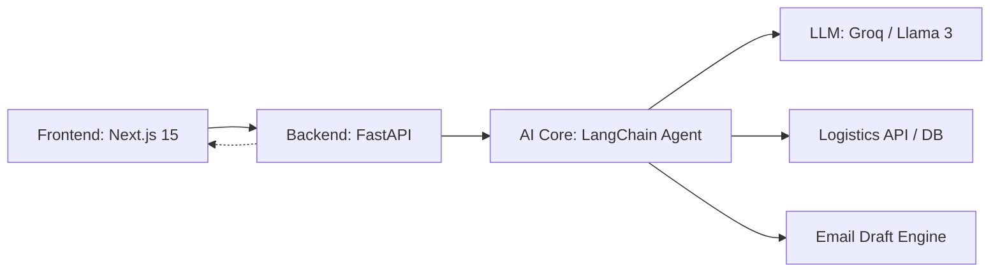

# SentinelFlow

**Autonomous Agentic Reconciliation Engine for enterprise logistics.**

## The "Digitalization" Problem: The Logistics Reconciliation Gap

Global logistics systems lose billions annually to "Reconciliation Gaps"—the friction between physical shipment anomalies (weather delays, hub congestion, carrier errors) and the internal data systems intended to track them. Traditionally, identifying a delay and communicating it to customers requires manual cross-referencing across multiple siloed platforms, leading to high operational overhead and customer dissatisfaction.

**SentinelFlow** bridge this gap by deploying an autonomous AI core that continuously monitors logistics streams, identifies anomalies in real-time, and executes complex "Thought-Action" cycles to resolve them. It transforms a reactive process into a proactive, agentic workflow.

## Key Features

### Autonomous Agentic Reasoning
SentinelFlow is built on multi-step reasoning cycles. Using advanced LLMs (Llama 3), the agent doesn't just process data; it "thinks" through the implications of a logistics event, deciding when to query databases and when to draft communications.

### Human-in-the-Loop (HITL)
While the engine is autonomous, it maintains enterprise-grade control via a seamless approval workflow. AI-generated drafts are presented as editable templates, requiring explicit human validation before final execution, ensuring 100% brand alignment and accuracy.

### Real-time Execution Trace
Engineered for transparency, SentinelFlow provides a live visual trace of the AI’s decision-making process. The Decision Graph translates abstract LLM "thoughts" into a structured flowchart, providing full auditability of every action taken.

### Enterprise Dashboard
A high-impact mission control interface displaying critical KPIs including efficiency gains, data integrity scores, and live AI core status. Designed for executive-level oversight and operational agility.

## Architecture



## Tech Stack

| Component | Technology | Description |
| :--- | :--- | :--- |
| **Frontend** | Next.js 15, Tailwind CSS | High-performance, responsive React framework. |
| **Backend** | FastAPI, Uvicorn | High-concurrency Python ASGI web framework. |
| **AI Layer** | LangChain, Groq, Llama 3 | Agentic orchestration and state-of-the-art LLM. |
| **Data Flow** | Server-Sent Events (SSE) | Real-time streaming of agent execution steps. |

## Installation & Quickstart

### Backend Setup
1. Navigate to the `backend` directory.
2. Create and activate a virtual environment:
   ```bash
   python -m venv venv
   source venv/bin/activate  # On Windows: venv\Scripts\activate
   ```
3. Install dependencies:
   ```bash
   pip install -r requirements.txt
   ```
4. Configure your `.env` file with your `GROQ_API_KEY`.
5. Start the engine:
   ```bash
   python -m uvicorn app.main:app --reload --port 8000
   ```

### Frontend Setup
1. Navigate to the `frontend` directory.
2. Install NPM packages:
   ```bash
   npm install
   ```
3. Start the development server:
   ```bash
   npm run dev
   ```

## Business Impact

SentinelFlow is designed to deliver immediate ROI through process digitalization:
- **4.2 Minutes Saved per Order**: Automation of status checks and communication drafting.
- **100% Data Integrity**: Elimination of manual entry errors via direct database reconciliation.
- **Operational Scalability**: Effortlessly handle batch processing of thousands of orders simultaneously.